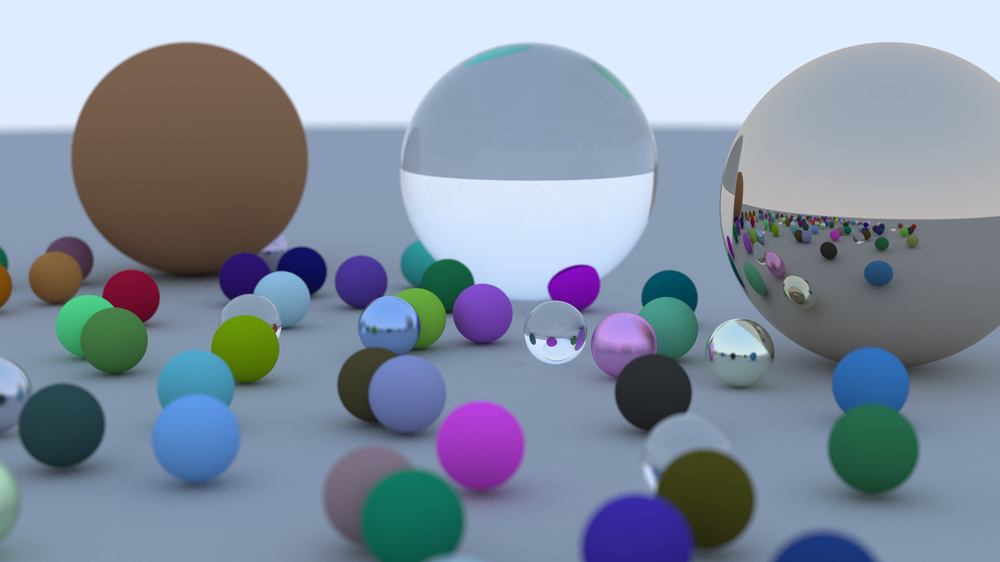

# Rust Raytracer

A basic raytracer following [Raytracing in one weekend](https://raytracing.github.io/books/RayTracingInOneWeekend.html)
made in rust.

In the future, I will add more functions from the later books.

## Example image

